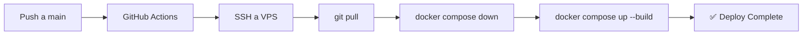

# CI/CD - Deploy Automático a VPS

Este proyecto usa GitHub Actions para desplegar automáticamente cuando se hace push a `main`.

## Configuración de Secretos (Solo Primera Vez)

Ve a tu repositorio en GitHub:
**Settings → Secrets and variables → Actions → New repository secret**

Agrega estos 3 secretos:

| Nombre | Valor |
|--------|-------|
| `VPS_HOST` | `91.99.188.229` |
| `VPS_USER` | `samuel` |
| `VPS_PASSWORD` | Tu contraseña SSH |

## Cómo Funciona

## Uso

1. Haz cambios en tu código
2. Commit y push a `main`
3. GitHub Actions desplegará automáticamente

## Ver Estado del Deploy

- Ve a tu repositorio en GitHub
- Click en la pestaña **Actions**
- Verás el estado de cada deploy

## Deploy Manual

También puedes ejecutar el deploy manualmente:
1. Ve a **Actions → Deploy to VPS**
2. Click en **Run workflow**
